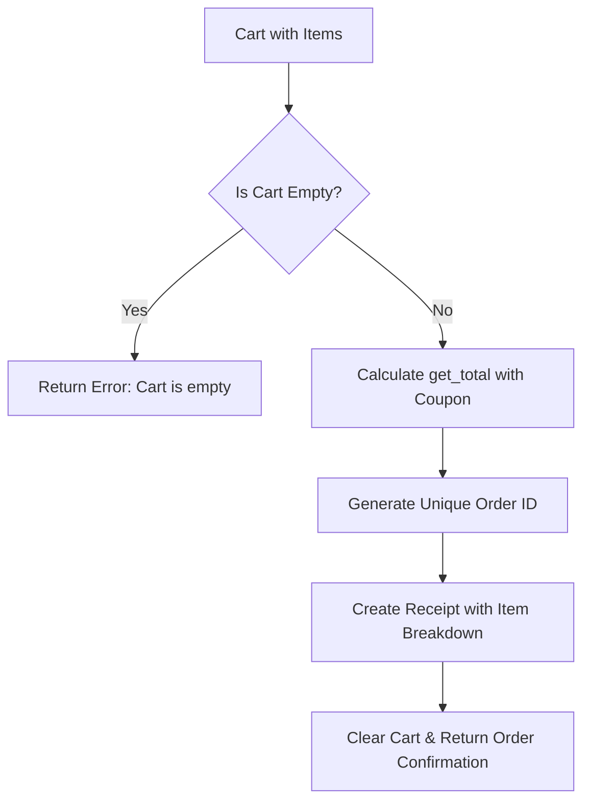

# Day 11 — Getters, Setters, @property & Cart Lifecycle
## Project 3: Online Shopping Cart

> **Revisits from Days 9-10:** `Product` polymorphism (`calculate_price()`), Encapsulation (private/protected variables), Coupon logic (`validate_coupon`, `apply_discount`, `get_total`)

---

## What You Already Know (Quick Recap)

On Day 9 & 10, you built:
1. Polymorphic product pricing (`DigitalProduct`, `PhysicalProduct`).
2. Adding items to a cart dict: `add_to_cart(cart, product, qty)`.
3. Validating coupons and computing discounted totals: `get_total(cart, coupon_code)`.

Right now, your shopping cart needs **dynamic lifecycle controls**:
- What if a customer wants to change quantity from 2 to 5?
- What if they change quantity to 0 or negative numbers? (Should it remove the item or throw an error?)
- What if they want to remove an item completely?
- How does the **Checkout** process generate a finalized order receipt?

---

## Concept 1: The `@property` Decorator & Getters/Setters

In Python, instead of writing Java-style `get_price()` and `set_price(val)`, we use the pythonic `@property` decorator to manage private/protected variables cleanly while adding **validation rules**.

```python
class Item:
    def __init__(self, name, price, stock=10):
        self.name = name
        self._price = price          # Protected variable
        self._stock = stock

    # GETTER: Access it like an attribute (item.price instead of item.get_price())
    @property
    def price(self):
        return self._price

    # SETTER: Runs validation before modifying the attribute
    @price.setter
    def price(self, new_price):
        if new_price < 0:
            raise ValueError("Price cannot be negative!")
        self._price = new_price

    @property
    def in_stock(self):
        """Computed read-only property"""
        return self._stock > 0
```

### Why use `@property`?
1. **Clean syntax**: Call `item.price` directly, without parenthesis.
2. **Data validation**: The setter intercepts the assignment `item.price = -50` and blocks invalid data.
3. **Read-only attributes**: Defining only `@property` without a setter makes the attribute immutable from outside.

---

## Concept 2: Cart Item State Mutation

When managing items in a cart dictionary:
```python
cart = {
    "P001": {
        "product_id": "P001",
        "name": "Notebook",
        "quantity": 2,
        "unit_price": 200,
        "subtotal": 400
    }
}
```

Every time `quantity` changes:
1. `subtotal` **must be recalculated** (`quantity * unit_price`).
2. If `new_quantity <= 0`: The item should automatically be deleted from the cart.
3. If `product_id` does not exist in `cart`: Return an appropriate status/error dictionary.

---

## Concept 3: The Checkout Transaction Flow

When the customer clicks **Checkout**:
1. Check if the cart is empty (cannot checkout an empty cart).
2. Calculate the final financial breakdown using `get_total(cart, coupon_code)`.
3. Generate an `order_id` (e.g. `ORD-2026-XXXX`).
4. Attach payment details (`payment_method`, `status: "PAID"`, `timestamp`).
5. Clear or freeze the cart for the next order.



---

## What You're Building Today

**Day 11 Logic Functions for Project 3:**

| Function | What it does |
|:---|:---|
| `update_quantity(cart, product_id, new_quantity)` | Updates item count & subtotal; deletes item if `new_quantity <= 0` |
| `remove_item(cart, product_id)` | Safely removes an item from cart; returns success boolean and message |
| `checkout(cart, coupon_code=None, payment_method="card")` | Finalizes order, generates receipt with `order_id`, and clears cart |

---

## 10-Minute Read Check ✅

You now understand:
- [ ] How `@property` creates pythonic getters and setters with validation
- [ ] Why recalculating `subtotal` on quantity updates is essential
- [ ] How to handle edge cases (negative quantities, removing missing items)
- [ ] How a complete checkout receipt is constructed from cart state

**Now open `practice.py` and write your 3 functions!**
